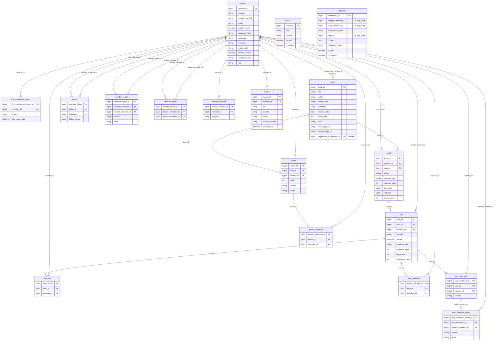

# Libri 도메인 ERD

JPA `@Entity` 기준으로 `src/main/java` 하위 도메인을 정리했습니다. 공통 상위 타입 `AuditableEntity`(`@MappedSuperclass`)는 테이블이 없으며, 모든 엔티티에 `created_date`, `last_modified_date`, `created_by`, `last_modified_by`가 포함됩니다.

## 엔티티 목록

| 엔티티 | 테이블명(명시/기본) | 패키지 |
|--------|---------------------|--------|
| Member | `member` | `member.domain` |
| MemberReport | `member_report` | `member.domain` |
| MemberBlock | `member_block` | `block.domain` |
| FcmNotificationToken | `fcm_notification_token` | `fcm.domain` |
| Book | `book` (기본) | `book.domain` |
| Shelf | `shelf` | `shelf.domain` |
| Note | `note` | `note.domain` |
| NoteLike | `note_like` | `note.domain` |
| NoteBookmark | `note_bookmark` | `note.domain` |
| NoteComment | `note_comment` | `comment.domain` |
| NoteCommentReport | `note_comment_report` | `comment.domain` |
| Follow | `follow` (기본) | `follow.domain` |
| Review | `review` | `review.domain` |
| ReviewBookmark | `review_bookmark` | `review.domain` |
| SearchKeyword | `search_keyword` | `search.domain` |
| Notification | `notification` | `notification.domain` |
| Notice | `notice` (기본) | `notice.domain` |
| Inquiry | `inquiry` (기본) | `inquiry.domain` |

## ERD (Mermaid)

GitHub·GitLab·VS Code(Mermaid 확장) 등에서 렌더링할 수 있습니다.

## Notification (논리적 연결)

`Notification`은 `recipient_member_id`, `actor_member_id`, `note_id`를 **Long 컬럼**으로만 들고 있으며, JPA `@ManyToOne`은 없습니다. DB FK 제약이 없을 수 있으나, 의미상은 다음과 같습니다.

- `recipient_member_id` → 수신자 `member.member_id`
- `actor_member_id` → 행위자 `member.member_id`
- `note_id` → `note.note_id`

## 유니크 제약 (요약)

- `member`: `email`, `(provider, provider_user_id)`
- `shelf`: `(member_id, book_id)`
- `note_like`: `(note_id, member_id)`
- `note_bookmark`: `(note_id, member_id)`
- `note_comment_report`: `(note_comment_id, reporter_member_id)`
- `member_report`: `(reported_member_id, reporter_member_id)`
- `member_block`: `(blocker_member_id, blocked_member_id)`
- `review_bookmark`: `(review_id, member_id)`
- `fcm_notification_token`: `(member_id, token)`

## Follow 엔티티 참고

- PK 컬럼명은 `member_follow`로 매핑되어 있습니다(`@Column(name = "member_follow")`).
- `follow_id` / `following_id` 컬럼명은 도메인상 **팔로우하는 사람 / 팔로우 당하는 사람**에 각각 대응합니다. 코드 필드명은 `follower` / `following`입니다.

---

*생성 기준: 저장소 내 JPA 엔티티 소스. 운영 DB 스키마는 `ddl-auto`·마이그레이션에 따라 일부 타입·제약이 다를 수 있습니다.*
